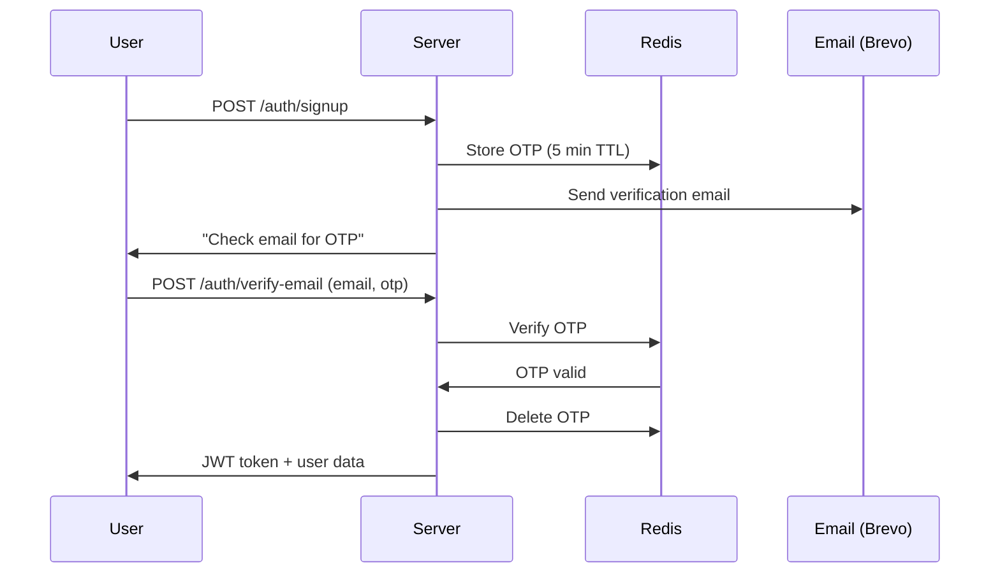

# 🔗 URL Shortener Backend

A powerful, production-ready RESTful API for URL shortening with user authentication, click analytics, QR code generation, and more.


---

## ✨ Features

- **🔐 Secure Authentication** - JWT-based authentication with email verification via OTP
- **🔗 URL Shortening** - Generate short URLs with optional custom aliases
- **📊 Click Analytics** - Track clicks with device type, location, and browser info
- **📱 QR Code Support** - Generate and store QR codes for short URLs
- **🖼️ Image Upload** - Profile pictures and QR codes stored on Cloudinary
- **⚡ Rate Limiting** - Redis-powered rate limiting to prevent abuse
- **📧 Email Service** - OTP emails via Brevo (formerly Sendinblue)

---

## 🛠️ Tech Stack

| Technology | Purpose |
|------------|---------|
| **Express.js** | Web framework |
| **MongoDB + Mongoose** | Database & ODM |
| **JWT** | Authentication tokens |
| **Bcrypt.js** | Password hashing |
| **Cloudinary** | Image storage (profile pics, QR codes) |
| **Upstash Redis** | OTP storage & rate limiting |
| **Brevo** | Transactional emails |
| **Multer** | File upload handling |

---

## 📁 Project Structure

```
Backend/
├── middleware/
│   ├── auth.js           # JWT authentication middleware
│   ├── rateLimiter.js    # Redis-based rate limiting
│   └── upload.js         # Multer file upload config
├── models/
│   ├── User.js           # User schema with password hashing
│   ├── Url.js            # URL schema
│   └── Click.js          # Click analytics schema
├── routes/
│   ├── auth.js           # Authentication endpoints
│   ├── urls.js           # URL CRUD operations
│   ├── clicks.js         # Click analytics endpoints
│   └── redirect.js       # Short URL redirection
├── utils/
│   ├── cloudinary.js     # Cloudinary upload/delete helpers
│   ├── email.js          # Brevo email service
│   └── redis.js          # Redis OTP management
├── server.js             # Express app entry point
├── package.json          # Dependencies and scripts
└── .env                  # Environment variables (not in repo)
```

---

## 🚀 Quick Start

### Prerequisites

- **Node.js** 18+
- **MongoDB** database (local or Atlas)
- **Cloudinary** account
- **Upstash Redis** database
- **Brevo** account (for emails)

### Installation

1. **Clone the repository**
   ```bash
   git clone https://github.com/izahid19/Url_shortner_backend.git
   cd Backend
   ```

2. **Install dependencies**
   ```bash
   npm install
   ```

3. **Configure environment variables**
   
   Create a `.env` file in the root directory:
   ```env
   # Server
   PORT=5000
   FRONTEND_URL=http://localhost:5173

   # Database
   MONGO_DB_URL=mongodb+srv://<username>:<password>@cluster.mongodb.net/url-shortener

   # JWT
   JWT_SECRET=your-super-secret-jwt-key
   JWT_EXPIRES_IN=7d

   # Cloudinary
   CLOUDINARY_CLOUD_NAME=your-cloud-name
   CLOUDINARY_API_KEY=your-api-key
   CLOUDINARY_API_SECRET=your-api-secret

   # Upstash Redis
   UPSTASH_REDIS_REST_URL=https://your-redis.upstash.io
   UPSTASH_REDIS_REST_TOKEN=your-redis-token

   # Brevo (Email)
   BREVO_API_KEY=your-brevo-api-key
   BREVO_SENDER_EMAIL=noreply@yourdomain.com
   BREVO_SENDER_NAME=URL Shortener
   ```

4. **Start the server**
   ```bash
   # Development (with auto-reload)
   npm run dev

   # Production
   npm start
   ```

5. **Verify it's running**
   ```bash
   curl http://localhost:5000/api/health
   # Response: {"status":"ok","message":"Server is running"}
   ```

---

## 📚 API Reference

### Base URL
```
http://localhost:5000/api
```

### Authentication

| Method | Endpoint | Description | Auth Required |
|--------|----------|-------------|---------------|
| `POST` | `/auth/signup` | Register new user | ❌ |
| `POST` | `/auth/verify-email` | Verify email with OTP | ❌ |
| `POST` | `/auth/resend-otp` | Resend verification OTP | ❌ |
| `POST` | `/auth/login` | Login user | ❌ |
| `GET` | `/auth/me` | Get current user | ✅ |
| `POST` | `/auth/forgot-password` | Request password reset | ❌ |
| `POST` | `/auth/reset-password` | Reset password with OTP | ❌ |
| `PUT` | `/auth/update-profile` | Update user profile | ✅ |

### URLs

| Method | Endpoint | Description | Auth Required |
|--------|----------|-------------|---------------|
| `GET` | `/urls` | Get all user's URLs | ✅ |
| `GET` | `/urls/:id` | Get single URL | ✅ |
| `POST` | `/urls` | Create short URL | ✅ |
| `DELETE` | `/urls/:id` | Delete URL | ✅ |

### Click Analytics

| Method | Endpoint | Description | Auth Required |
|--------|----------|-------------|---------------|
| `GET` | `/clicks/:urlId` | Get clicks for a URL | ✅ |

### Redirection

| Method | Endpoint | Description | Auth Required |
|--------|----------|-------------|---------------|
| `GET` | `/:shortCode` | Redirect to original URL | ❌ |

---

## 📋 API Examples

### Register a New User

```bash
curl -X POST http://localhost:5000/api/auth/signup \
  -H "Content-Type: application/json" \
  -d '{
    "name": "John Doe",
    "email": "john@example.com",
    "password": "securepassword123"
  }'
```

**Response:**
```json
{
  "success": true,
  "message": "Account created. Please check your email for verification code.",
  "email": "john@example.com"
}
```

### Create a Short URL

```bash
curl -X POST http://localhost:5000/api/urls \
  -H "Content-Type: application/json" \
  -H "Authorization: Bearer <your-jwt-token>" \
  -d '{
    "title": "My Website",
    "longUrl": "https://example.com/very/long/url/path",
    "customUrl": "mysite"
  }'
```

**Response:**
```json
{
  "success": true,
  "data": [{
    "id": "507f1f77bcf86cd799439011",
    "title": "My Website",
    "original_url": "https://example.com/very/long/url/path",
    "short_url": "abc123",
    "custom_url": "mysite",
    "qr": "",
    "created_at": "2024-01-15T10:30:00.000Z"
  }]
}
```

---

## 🔒 Authentication Flow



---

## 🗄️ Database Models

### User Model
```javascript
{
  name: String,           // Required
  email: String,          // Required, unique
  password: String,       // Hashed with bcrypt
  profilePic: String,     // Cloudinary URL
  isVerified: Boolean,    // Email verified status
  createdAt: Date
}
```

### URL Model
```javascript
{
  userId: ObjectId,       // Reference to User
  title: String,          // URL title
  originalUrl: String,    // Original long URL
  shortUrl: String,       // Generated short code
  customUrl: String,      // Optional custom alias
  qr: String,             // QR code Cloudinary URL
  createdAt: Date
}
```

### Click Model
```javascript
{
  urlId: ObjectId,        // Reference to URL
  city: String,           // Location city
  country: String,        // Location country
  device: String,         // Device type
  browser: String,        // Browser name
  createdAt: Date
}
```

---

## ⚙️ Environment Variables

| Variable | Description | Required |
|----------|-------------|----------|
| `PORT` | Server port (default: 5000) | ❌ |
| `FRONTEND_URL` | Frontend URL for CORS | ✅ |
| `MONGO_DB_URL` | MongoDB connection string | ✅ |
| `JWT_SECRET` | Secret key for JWT signing | ✅ |
| `JWT_EXPIRES_IN` | JWT expiration time (default: 7d) | ❌ |
| `CLOUDINARY_CLOUD_NAME` | Cloudinary cloud name | ✅ |
| `CLOUDINARY_API_KEY` | Cloudinary API key | ✅ |
| `CLOUDINARY_API_SECRET` | Cloudinary API secret | ✅ |
| `UPSTASH_REDIS_REST_URL` | Upstash Redis REST URL | ✅ |
| `UPSTASH_REDIS_REST_TOKEN` | Upstash Redis REST token | ✅ |
| `BREVO_API_KEY` | Brevo API key | ✅ |
| `BREVO_SENDER_EMAIL` | Email sender address | ✅ |
| `BREVO_SENDER_NAME` | Email sender name | ✅ |

---

## 🧪 Health Check

```bash
GET /api/health
```

**Response:**
```json
{
  "status": "ok",
  "message": "Server is running"
}
```

---

## 🔧 Scripts

| Script | Command | Description |
|--------|---------|-------------|
| **Start** | `npm start` | Start production server |
| **Dev** | `npm run dev` | Start with auto-reload (Node.js 18+) |

---

## 📝 License

This project is licensed under the MIT License - see the [LICENSE](LICENSE) file for details.

---

## 🤝 Contributing

1. Fork the repository
2. Create your feature branch (`git checkout -b feature/amazing-feature`)
3. Commit your changes (`git commit -m 'Add amazing feature'`)
4. Push to the branch (`git push origin feature/amazing-feature`)
5. Open a Pull Request

---

## 📞 Support

For support, email mushtaqzahid888@gmail.com or create an issue in the [repository](https://github.com/izahid19/Url_shortner_backend/issues).

---

<div align="center">
  <p>Made with ❤️ by <strong>Zahid Mushtaq</strong></p>
</div>
